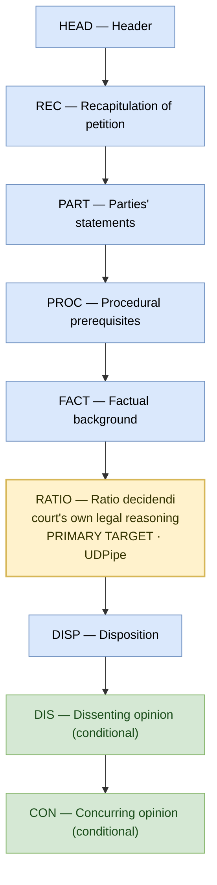

# Anotační schéma — rozhodnutí Ústavního soudu ČR

Schéma pro anotaci struktury rozhodnutí Ústavního soudu (nálezů i usnesení) v kontinentální právní tradici. Slouží jako codebook pro lidské anotátory i jako prompt pro LLM.

**Základní jednotka anotace je (číslovaný) odstavec.** Segment se odstavci přiřazuje podle jeho **převažující funkce a mluvčího v kontextu daného odstavce — nikoli podle nadpisu oddílu**, do něhož odstavec spadá. Táž kategorie se proto může v dokumentu objevit opakovaně a mimo idealizované pořadí (např. REC → PROC/FACT → REC → PART v rámci jednoho nadepsaného oddílu „Rekapitulace").

**Výjimky z odstavcové jednotky:**
- **Odlišná stanoviska (DIS/CON)** se značí jako celý vícoodstavcový oddíl, vymezený nadpisem a podpisem (zde se nadpis výjimečně použije jako hranice).
- **HEAD** a **hlavní výrok (DISP, span 1)** jsou bloky stojící před číslováním odstavců.

## Anatomie rozhodnutí

**Legenda:** modrá = vždy přítomné · žlutá = primární analytický cíl · zelená = podmíněné / gold standard.

> Citační podvrstva (CITE / JUD_CS / JUD_ECHR / JUD_FOR / LIT) z původního diagramu je samostatná a tento codebook ji zatím nespecifikuje.

---

## 1. Strukturní segmenty

### HEAD — Header (vždy)

**Definice.** Záhlaví rozhodnutí — souvislý blok na úplném začátku dokumentu, který předchází výroku i odůvodnění a slouží k formální identifikaci rozhodnutí a vymezení řízení. Zahrnuje spisovou značku a datum vydání, případnou sbírkovou značku (Sb., SbNU) a populární (sbírkový) název věci, formuli „Česká republika — NÁLEZ / USNESENÍ Ústavního soudu — Jménem republiky" a označení formy rozhodnutí. Součástí je i úvodní návětí, v němž soud uvádí složení senátu či pléna, soudce zpravodaje, stěžovatele (navrhovatele) a jeho právní zastoupení, napadená rozhodnutí či jiný zásah, účastníky a vedlejší účastníky řízení a předmět řízení.

**Konec spanu.** Uvozovací formule výroku „takto:" (resp. „t a k t o :").

**Nepatří sem.** Samotný výrok (→ DISP) ani odůvodnění.

**Pozn.** Horní prvky jsou nepovinné a u usnesení často chybí (SbNU, populární název, „Jménem republiky"). U starších a plenárních rozhodnutí návětí splývá do jediné věty („rozhodl v plénu ve věci návrhu … t a k t o :").

### REC — Recapitulation of petition (vždy)

**Definice.** Odstavce, v nichž soud reprodukuje obsah ústavní stížnosti (návrhu) — to, čeho se stěžovatel (navrhovatel) domáhá a z jakých důvodů. Patří sem vymezení napadených rozhodnutí či zásahu, označení ústavně zaručených práv, jejichž porušení stěžovatel tvrdí, jeho skutková a právní argumentace a samotný petit. Zahrnuje i pozdější **repliku stěžovatele** k vyjádřením ostatních, neboť i ta vyjadřuje jeho stanovisko.

**Kritérium.** Klasifikuje se podle mluvčího: odstavec reprodukující pozici **stěžovatele/navrhovatele** patří sem — i když je zařazen pod oddíl spolu s vyjádřeními stran (**mluvčí > nadpis**).

**Nepatří sem.** Vyjádření jiných subjektů (→ PART), procesní průběh a předpoklady (→ PROC), neutrální líčení skutkového a procesního pozadí soudem (→ FACT), hodnocení soudu (→ RATIO).

### PART — Parties' statements (vždy)

**Definice.** Odstavce, v nichž soud reprodukuje stanoviska jiných subjektů řízení než stěžovatele — vyjádření účastníků (orgánů, jejichž akt je napadán, popř. komor Parlamentu, prezidenta, vlády), vedlejších účastníků a amici curiae, včetně jejich duplik a doplňujících vyjádření. Pokrývá souhrn jejich argumentů a návrhů (typicky návrh na odmítnutí či zamítnutí), jak je soud podává.

**Kritérium.** Klasifikuje se podle mluvčího: odstavec reprodukující pozici subjektu **jiného než stěžovatele** patří sem (**mluvčí > nadpis**).

**Nepatří sem.** Replika samotného stěžovatele (→ REC), procesní úkony soudu (vyžádání vyjádření, postoupení věci) v rozsahu, v jakém nejde o shrnutí pozice strany (→ PROC), hodnocení vyjádření soudem (→ RATIO).

### PROC — Procedural prerequisites (vždy)

**Definice.** Odstavce, v nichž soud rekapituluje procesní průběh řízení před Ústavním soudem a posuzuje procesní předpoklady jeho projednání: včasnost a oprávněnost podání, právní zastoupení, přípustnost a vyčerpání opravných prostředků (§ 75 zákona o ÚS), příslušnost soudu, náležitosti návrhu (§ 34, § 71a a násl.) a otázku nařízení ústního jednání. Patří sem i procesní kroky uvnitř řízení před ÚS (postoupení věci senátem plénu apod.).

**Kritérium.** Span zachycuje úvahy o tom, **zda** lze věc projednat, nikoli **jak** má být věcně rozhodnuta.

**Nepatří sem.** Věcné posouzení důvodnosti (→ RATIO), reprodukce argumentů stran (→ REC, PART), líčení skutkového pozadí věci (→ FACT).

### FACT — Factual background (vždy / často krátké)

**Definice.** Odstavce, v nichž soud ve **vlastní, neutrální řeči** líčí skutkové a procesní pozadí věci a/nebo vymezuje právní otázku, kterou bude zodpovídat. Patří sem zejména popis napadených rozhodnutí a průběhu předchozího řízení (co a proč rozhodly nižší orgány a soudy), shrnutí rozhodného skutkového stavu a pojmenování jádra sporu jako přemostění k vlastnímu posouzení.

**Kritérium.** Soud zde nepřebírá pozici žádné strany ani neposuzuje důvodnost; pouze rekapituluje pozadí a rámuje otázku. Span končí tam, kde soud přechází od vymezení otázky k jejímu řešení (→ RATIO).

**Nepatří sem.** Skutkový stav reprodukovaný jako tvrzení strany (→ REC, PART), posouzení procesních předpokladů (→ PROC), aplikace ústavních zásad a závěr o důvodnosti (→ RATIO).

### RATIO — Ratio decidendi (vždy · PRIMÁRNÍ CÍL)

**Definice.** Odstavce odůvodnění, v nichž Ústavní soud věcně (meritorně) posuzuje samotný obsah ústavní stížnosti — pasáž, kde soud konfrontuje napadené rozhodnutí či jiný zásah orgánu veřejné moci s ústavně zaručenými právy stěžovatele a formuluje důvody, na nichž stojí výrok. Zahrnuje veškerou věcnou argumentaci: aplikaci ústavních zásad a testů, odkazy na judikaturu užité k odůvodnění závěru i doprovodné úvahy.

**Začátek spanu.** Tam, kde soud přechází od procesních předpokladů a vymezení věci k vlastnímu hodnocení namítaného porušení.

**Konec spanu.** Poslední odstavec věcného odůvodnění. **Rekapituluje-li závěrečný oddíl („Závěr") nosné důvody, patří tyto odstavce rovněž do RATIO** (viz pravidlo přednosti, §2) — do DISP jdou jen výrokové a formální složky.

**Nepatří sem.** Rekapitulace stížnosti a řízení (→ REC, FACT), vyjádření účastníků (→ PART), procesní posouzení (→ PROC), samotný výrok a poučení/náklady (→ DISP).

**Pozn.** Toto je vlastní autorský text soudu a primární cíl stylometrické analýzy (UDPipe). Doslovné neautorské citace uvnitř RATIO se před analýzou odstraňují (řešeno samostatně).

### DISP — Disposition (vždy · může tvořit dva nesouvislé spany)

**Definice.** Výrok (enunciát) — autoritativní rozhodnutí soudu o stížnosti či návrhu — a jeho formální rámec. Vyskytuje se zpravidla na dvou místech:

- **Span (1):** hlavní výrok bezprostředně za uvozovací formulí „takto:" na začátku dokumentu, často graficky zvýrazněný. Zahrnuje pouze samotné výrokové body.
- **Span (2):** **operativní a formální složky** závěrečného oddílu — samotné výrokové konstatování (např. „Ústavní soud zamítl ústavní stížnost"), poučení o opravných prostředcích, výrok o nákladech řízení a místo, datum a podpis.

**Nepatří sem.** Odstavce závěrečného oddílu, které rekapitulují nosné důvody rozhodnutí, do DISP **nepatří** (→ RATIO); ani rozvinutá věcná argumentace v těle odůvodnění (→ RATIO).

### DIS — Dissenting opinion (podmíněné)

**Definice.** Celý oddíl odlišného stanoviska soudce, který **nesouhlasí s výrokem** rozhodnutí.

**Span.** Začíná nadpisem typu „Odlišné stanovisko soudce/soudkyně …" a končí podpisem (jménem) téhož soudce či soudců; jedna souvislá vícoodstavcová jednotka zařazená za vlastním rozhodnutím.

**Klasifikační kritérium.** DIS tehdy, plyne-li z obsahu, že autor by hlasoval pro **jiný výrok**, než jaký byl přijat — brojí proti samotnému výsledku (nesouhlasí s tím, že bylo/nebylo vyhověno, s rozsahem vyhovění apod.). Signál: zaměření „k výroku", „nesouhlasím se zamítnutím/vyhověním", návrh, jak mělo být rozhodnuto jinak. Souhlasí-li autor s výrokem a brojí jen proti odůvodnění → CON.

### CON — Concurring opinion (podmíněné)

**Definice.** Celý oddíl odlišného stanoviska soudce, který **souhlasí s výrokem**, avšak neztotožňuje se s jeho odůvodněním nebo je chce doplnit.

**Span.** Vymezuje se stejně jako DIS: od nadpisu „Odlišné stanovisko …" po podpis autora.

**Klasifikační kritérium.** CON tehdy, plyne-li z obsahu, že autor by hlasoval pro **stejný výrok**, ale z jiných důvodů, popř. chce část odůvodnění upřesnit či odmítnout. Signál: zaměření „k odůvodnění", „souhlasím s výrokem, avšak…", výslovné označení „konkurující / souhlasné stanovisko". Odmítá-li autor samotný výsledek → DIS.

> **DIS vs. CON — společné pravidlo.** Obě nesou v textu týž nadpis „odlišné stanovisko"; rozdíl není v názvu, ale v obsahu (vztah autora k výroku). Nadpis někdy rozdíl prozradí („k výroku a odůvodnění" → DIS; „k odůvodnění" → CON). Smíšené stanovisko (disent k jednomu výrokovému bodu, konkurence k jinému) → viz pravidlo přednosti, §2.

---

## 2. Průřezová pravidla

**Anotace podle funkce, ne podle nadpisu.** Základní jednotkou je odstavec; každý odstavec se přiřadí kategorii podle své převažující funkce a mluvčího v daném kontextu, nezávisle na nadpisu oddílu. Jeden nadepsaný oddíl tak může obsahovat odstavce různých kategorií (např. oddíl „I. Rekapitulace případu" mísí pozici stěžovatele → REC, neutrální popis napadených rozhodnutí → FACT/PROC a vyjádření stran → PART). Jedinou výjimkou, kde se nadpis použije jako hranice, jsou odlišná stanoviska (DIS/CON).

**Mluvčí > nadpis.** Reprodukuje-li odstavec čí pozici, rozhoduje identita mluvčího, ne umístění v dokumentu: pozice stěžovatele → REC, pozice jiného subjektu → PART, vlastní řeč soudu → FACT/PROC/RATIO/DISP podle funkce.

**Nesouvislé spany jsou povolené.** DISP (span 1 + span 2), více samostatných DIS/CON oddílů a kategorie roztroušené mimo kanonické pořadí se značí každá zvlášť.

**Pravidlo přednosti při překryvu kategorií.**
1. *Závěrečný oddíl:* odstavce rekapitulující nosné důvody → **RATIO**; pouze výrokové konstatování, poučení, náklady řízení a místo/datum/podpis → **DISP**. Odstavec se přiřadí podle své převažující funkce.
2. *Replika stěžovatele vs. PART:* replika stěžovatele → **REC** (přednost mluvčího před umístěním v dokumentu), i sedí-li fyzicky v oddílu vyjádření stran.
3. *Popis napadených rozhodnutí a předchozího řízení:* neutrální líčení soudem → **FACT** (procesní kroky → PROC); tytéž skutečnosti podané jako argument stěžovatele → REC, jako argument jiné strany → PART.
4. *Smíšené odlišné stanovisko:* klasifikuj podle převažujícího charakteru vůči výroku; je-li vyváženě obojí, preferuj **DIS** (nesouhlas s výrokem je silnější signál) a poznač smíšenou povahu.
