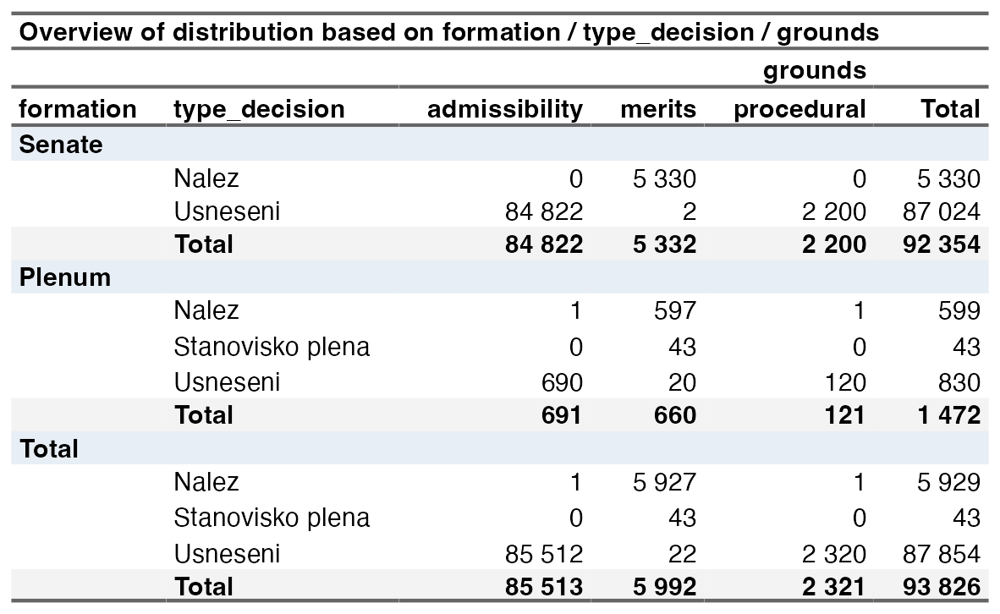
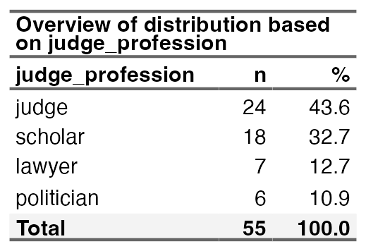
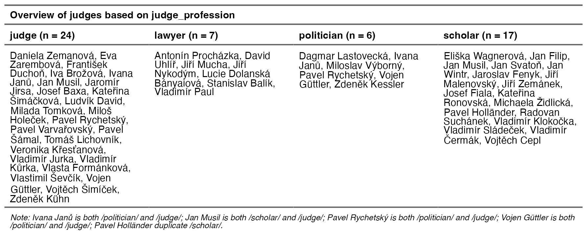

# Descriptive tables — Czech Constitutional Court database

Quick visual reference for the three descriptive tables produced by
[`descriptive_stuff.R`](./descriptive_stuff.R). Source data:
`data/ccc_database/csv/ccc_metadata.csv` and `data/ccc_database/csv/ccc_judges.csv`.

---

## 1. Three-way contingency: formation × type_decision × grounds

Chambers (First / Second / Third / Fourth) are collapsed into a single **Senate**
group; Plenum is kept separate.

---

## 2. One-way frequency: judge_profession

---

## 3. Judges grouped by profession

Each column lists the judges that fall under a given profession, with judge
counts in the column header. The footnote flags judges that appear under more
than one profession (because they had multiple terms recorded with different
profession labels) and one duplicate record.

