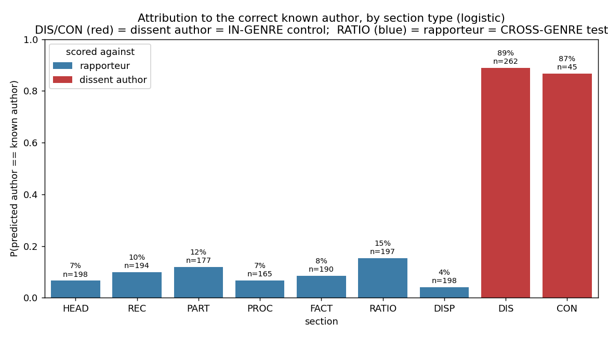
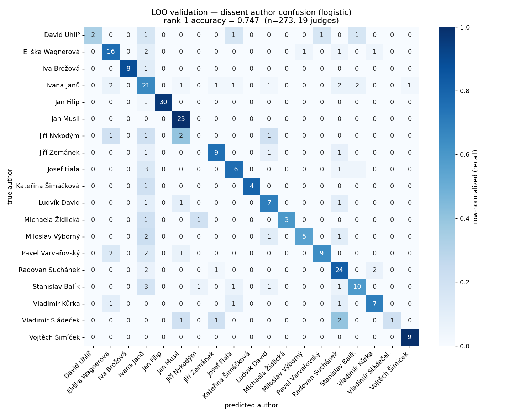
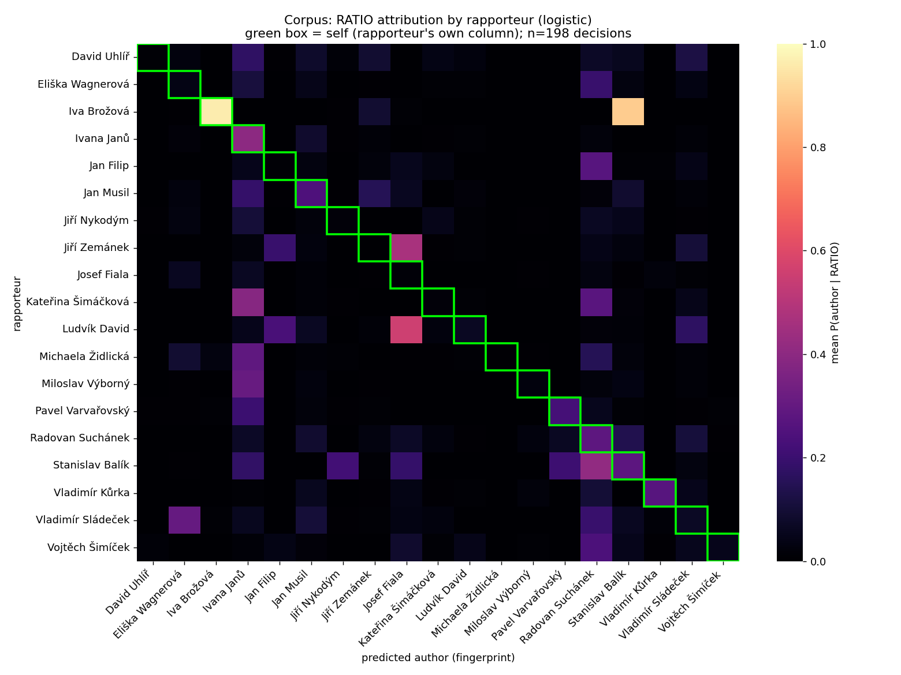
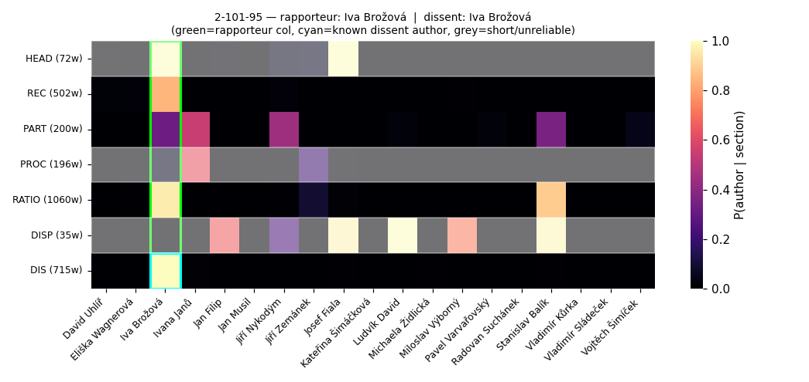
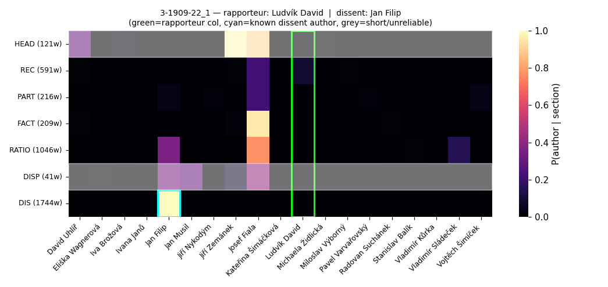

# Experiment 03 — Methodology & Results

LLM-annotated, self-contained authorship / ghostwriting analysis of Czech
Constitutional Court (ÚS) decisions. First complete end-to-end run (logistic
classifier; XGBoost and a clerk-data extension deferred — see §9).

---

## 0. Results at a glance

1. **The fingerprint is real (in-genre).** Per-judge classifiers trained on
   signed separate opinions identify their authors at **74.7% rank-1** accuracy
   (19 judges, leave-one-out; macro ROC-AUC 0.93). Applied to *other* separate
   opinions (same genre, known author) they hit **88.6%**. The method works.
2. **Cross-genre attribution is weak.** Applied to the court's majority
   reasoning (**RATIO**), the fingerprint matches the decision's rapporteur only
   **15.2%** of the time (median P 0.006). See the section-type figure below —
   DIS/CON (in-genre) tower over RATIO (cross-genre).
3. **But this is *not* "genre explains everything," and it is *not* "ghostwriting
   everywhere" — we cannot yet decompose the two.** Two facts block a clean
   conclusion in opposite directions:
   - **Genre transfer demonstrably works for some judges** — 6 of 19 rapporteurs'
     RATIOs match their *own* fingerprint above any other judge's (Janů, Suchánek,
     Kůrka, Musil, Brožová, Varvařovský). So "the majority register erases
     personal style" is false as a universal claim.
   - **Yet most rapporteurs' RATIOs do not self-match**, and a few resemble a
     *specific other judge* far beyond chance — the targeted pattern genre cannot
     easily produce.
4. **Strongest concrete leads (targeted cross-attribution):** **Ludvík David →
   Josef Fiala** (7.4× lift, n=18) and **Jiří Zemánek → Josef Fiala** (5.1×,
   n=14). Two different chambers' RATIOs systematically resembling one specific
   judge is the most ghostwriting-like signal in the data.

> **Bottom line.** We have a validated in-genre fingerprint and a clean, large
> in-genre↔cross-genre gap. We can **triage** rapporteurs (own-hand vs targeted
> vs no-signal) but we **cannot quantify** the genre-vs-ghostwriting split
> without external ground truth (clerk assignments — §9). Earlier framing that
> "genre drives the gap" was premature and is corrected here.

*Each bar: fraction of sections whose top-predicted author equals the **correct
known author** — rapporteur for court-voice sections (blue), the signed dissent
judge for DIS/CON (red). DIS/CON are the in-genre control (same genre the model
was trained on); RATIO is the cross-genre test. RATIO is the strongest of the
blue (court-voice) bars — the rapporteur signal is real, just weak across genre.*

---

## 1. Goal

Detect potential ghostwriting: is the **RATIO** (the court's own legal reasoning,
authored under the *rapporteur* / soudce zpravodaj) written in the rapporteur's
hand? We isolate authorship-bearing text by LLM structural annotation — RATIO =
reasoning; DIS/CON = separate opinions by named judges — and apply per-judge
stylometric classifiers. Every input is regenerable from code + a NALUS scrape;
no dependency on the legacy `subset_disent2.csv`.

## 2. Pipeline (self-contained)

| Stage | Code | Output |
|------|------|--------|
| 0 corpus | `scrape/build_seed_list.py` | `corpus/seed.tsv` — 309 (file_id, ECLI) |
| 1 scrape | `scrape/` (Selenium + ECLI search → record card) | `data/01_scraped/` (rapporteur, clean separate_opinion, dates, formation, body) |
| 2 annotate | `llm_annotate/` (Claude Sonnet, 9-category boundaries) | `data/05_tagged/` |
| 3a spans | `extract_tags.py` | `data/07_spans/` |
| 3b dataset | `build_dataset.py`, `build_sections.py`, `authorship.py` | `data/dataset/{decisions,dissents,sections}.csv` |
| 4 analyze | `fingerprint/`, `scripts/06_analyze.py`, `score_sections.py`, `plots.py` | `outputs/` |

Reproduce: see `README.md`; run `scripts/01..06`, then `score_sections.py` and
`plots.py`. UDPipe `czech-pdt-ud-2.5` required (gitignored).

## 3. Data

- **Corpus**: 309 decisions seeded from ECLIs (236 senate + 73 plenary — the
  plenary-regex fix recovered the 73 the legacy scrape silently dropped).
- **Scraped**: **308/309** (one plenary, `Pl-42-17_1`, returned no ECLI hit).
  Record cards yield clean nominative `judge_rapporteur_name` and
  `separate_opinion`.
- **Annotated**: all 308 (original 236 human-reviewed; 72 new plenary
  machine-annotated only — §9). Span extraction: 0 tag problems.
- **Dataset**: 308 decisions (307 with RATIO), **308 separate opinions**, 2359
  sections. After the ≥5-opinions training filter: **19 judges, 273 opinions**.
  Author labels sourced entirely from the record cards (0 unattributed).

## 4. Method & metrics

**Model.** One binary logistic classifier per judge (one-vs-rest), trained on
that judge's DIS/CON span text. Features (identical to experiment-02 for
comparability): function words, surface statistics, character 3-grams, POS
2-grams, morphology — all from UDPipe tagging. `StandardScaler` + logistic
regression per author.

**Why train on dissents.** They are **signed** — authorship is trusted ground
truth. RATIO has no trustworthy author label (the rapporteur is the *presumed*
author — exactly what is in question), so dissents are the only sound anchor; we
never train on RATIO.

**Metrics (defined).**
- **Rank-1 accuracy** — over the 273 dissents, leave-one-out: fraction whose
  *true* author is the single highest-scoring classifier. Chance ≈ 1/19 ≈ 5.3%.
- **Rank-3** — true author within the top 3 scores. **MRR** — mean of 1/(rank of
  true author); rewards putting the truth near the top.
- **ROC-AUC / PR-AUC** (per author, one-vs-rest) — ranking quality / precision
  under class imbalance; **F1/Prec/Rec** at the 0.5 threshold.
- **Raw probability `P(author | text)`** — each judge's *independent* classifier's
  confidence that the text is theirs. Not mutually normalized (a text can score
  high or low for several judges at once); this is the honest "fingerprint match
  strength," and what the heatmaps show.
- **Match rate** — fraction of items whose argmax author equals the known author.
- **Lift** — `P(R's RATIOs resemble A) / P(other rapporteurs' RATIOs resemble A)`;
  how much more rapporteur R's RATIOs look like judge A than baseline. >1 = R
  resembles A above chance; a high, specific lift is the ghostwriting signature.
- **P_self / best_other** — mean `P(R | R's own RATIOs)` vs the highest mean
  `P(other judge | R's RATIOs)`; `P_self ≥ best_other` ⇒ the rapporteur's RATIO
  resembles their own hand more than anyone else's.

**Apply.** Score every decision's RATIO and (via `score_sections.py`) every
section, for the per-decision cards and the in/cross-genre control.

## 5. Validation — the fingerprint is real (in-genre)

LOO over 19 judges: **rank-1 = 0.747**, rank-3 = 0.894, MRR = 0.83, macro
ROC-AUC = **0.93**. The confusion matrix is strongly diagonal. Per-judge AUC is
high almost everywhere; weakness is confined to the smallest classes (n = 5–6).

| judge | n | ROC-AUC | F1 | judge | n | ROC-AUC | F1 |
|---|--:|--:|--:|---|--:|--:|--:|
| Jan Filip | 31 | 0.999 | 0.95 | Radovan Suchánek | 29 | 0.94 | 0.71 |
| Vojtěch Šimíček | 9 | 1.00 | 0.94 | Stanislav Balík | 17 | 0.96 | 0.64 |
| Jan Musil | 23 | 0.997 | 0.91 | Pavel Varvařovský | 14 | 0.996 | 0.73 |
| Iva Brožová | 9 | 1.00 | 0.88 | Eliška Wagnerová | 21 | 0.957 | 0.54 |
| Jiří Zemánek | 12 | 0.967 | 0.82 | Ivana Janů | 32 | 0.869 | 0.44 |
| Josef Fiala | 21 | 0.981 | 0.82 | Jiří Nykodým | 5 | 0.377 | 0.00 |

(full table: `outputs/loo_summary_logistic.txt`)

This gates everything below — but only establishes per-judge style *within the
separate-opinion genre*.

## 6. Results

### 6.1 In-genre vs cross-genre (the central control)

Same model, same corpus, scoring each section against its **appropriate** known
author (court-voice → rapporteur; DIS/CON → signed dissent judge):

| section | scored vs | n | match rate |
|---|---|--:|--:|
| **DIS** | dissent author | 262 | **88.9%** |
| **CON** | dissent author | 45 | **86.7%** |
| RATIO | rapporteur | 197 | 15.2% |
| PART | rapporteur | 177 | 11.9% |
| REC | rapporteur | 194 | 9.8% |
| FACT | rapporteur | 190 | 8.4% |
| PROC / HEAD / DISP | rapporteur | 165–198 | 4–7% |

The ~89% (in-genre) vs 15% (cross-genre) contrast is the core result. Note RATIO
is the **highest** court-voice bar — the rapporteur signal is genuinely present
in RATIO, just weak. (Caveat: the 88.9% is partly held-*in* — those DIS spans are
largely the training instances — so the honest held-*out* in-genre figure is the
LOO 74.7%; the gap to 15.2% holds either way.)

### 6.2 Corpus attribution matrix (RATIO)

Rows = rapporteur, columns = predicted author, cell = mean `P(author | RATIO)`
over that rapporteur's decisions (198 with a trained-judge rapporteur). The
diagonal (own column, green box) is mostly dark; mass concentrates in a few
"attractor" columns.

### 6.3 Triage: who writes their own RATIO? (Table A)

Per rapporteur, mean `P_self` vs the best competing judge. `P_self ≥ best_other`
⇒ the RATIO resembles the rapporteur's own hand more than anyone else's
(`outputs/rapporteur_selfmatch.csv`).

| rapporteur | n | P_self | best other | P | bucket |
|---|--:|--:|---|--:|---|
| Ivana Janů | 7 | **0.40** | Jan Musil | 0.08 | self-match |
| Radovan Suchánek | 16 | **0.28** | Stanislav Balík | 0.14 | self-match |
| Vladimír Kůrka | 7 | **0.27** | Radovan Suchánek | 0.10 | self-match |
| Jan Musil | 7 | **0.24** | Ivana Janů | 0.18 | self-match |
| Pavel Varvařovský | 3 | **0.23** | Ivana Janů | 0.20 | self-match |
| Iva Brožová | 1 | **0.96** | Stanislav Balík | 0.89 | self-match¹ |
| Ludvík David | 18 | 0.06 | **Josef Fiala 0.56** | | cross-attrib |
| Jiří Zemánek | 14 | 0.00 | **Josef Fiala 0.47** | | cross-attrib |
| Kateřina Šimáčková | 9 | 0.02 | Ivana Janů 0.39 | | cross-attrib |
| Vojtěch Šimíček | 35 | 0.05 | Suchánek 0.24 | | no strong signal |
| Jiří Nykodým / Josef Fiala | 13/5 | <0.02 | low | | no-signal |

¹ Brožová has only 1 decision as rapporteur in the trained set — suggestive, not robust.

Roughly **6/19 self-match** (own hand plausible); the rest split between targeted
cross-attribution and no-signal.

### 6.4 Targeted cross-attribution (Table B)

Rapporteur→author pairs where the RATIO resembles a *specific* other judge well
above that judge's baseline (`P_on > 0.25`; `outputs/targeted_pairs.csv`):

| rapporteur | n | resembles | P(on) | P(off) | lift |
|---|--:|---|--:|--:|--:|
| **Ludvík David** | 18 | **Josef Fiala** | 0.56 | 0.08 | **7.4×** |
| **Jiří Zemánek** | 14 | **Josef Fiala** | 0.47 | 0.09 | **5.1×** |
| Kateřina Šimáčková | 9 | Ivana Janů | 0.39 | 0.10 | 4.1× |
| Miloslav Výborný | 5 | Ivana Janů | 0.31 | 0.10 | 3.0× |
| Stanislav Balík | 5 | Radovan Suchánek | 0.41 | 0.15 | 2.7× |
| Vladimír Sládeček | 3 | Eliška Wagnerová | 0.30 | 0.01 | 21.1ײ |

² high lift but n=3. The robust, large-n leads are **David→Fiala** and
**Zemánek→Fiala** — two chambers' RATIOs resembling Fiala specifically. Genre
shift would pull toward the register centroid, not toward one named judge; the
specificity is what makes these ghostwriting / shared-clerk candidates.

### 6.5 Featured per-decision cards

`outputs/cards/<doc_id>.png` (308 total). Rows = sections in document order with
word counts; rapporteur column boxed **green**; signed dissent author boxed
**cyan** on DIS/CON rows; sections < 200 words **greyed** (below the stylometry
reliability floor).

**Own-hand exemplar — `2-101-95` (Iva Brožová, rapporteur & dissenter).** RATIO
*and* DIS both light up Brožová (~0.96): her style transfers from dissent to
majority reasoning.

**Targeted candidate — `3-1909-22_1` (rapporteur Ludvík David).** The RATIO
lights up **Josef Fiala** (~0.77), not David. Representative of the David→Fiala
pattern across 18 decisions.

### Correction
An earlier draft featured a "Šimíček→Fiala" lead. On raw probabilities that is an
**artifact**: Šimíček's RATIOs match *no* judge strongly (Fiala lift 0.7×, i.e.
below baseline), so the argmax was noise over near-zero scores. Retracted; the
genuine targeted leads are David/Zemánek→Fiala.

## 7. Interpretation

- The fingerprint is valid in-genre; cross-genre attribution to the rapporteur is
  weak (15.2%) but **non-zero and the strongest among court-voice sections**.
- **We cannot decompose genre vs ghostwriting into magnitudes** without external
  ground truth. Both depress cross-genre self-attribution.
- Against a *universal* genre explanation: **6 judges' RATIOs do self-match**, so
  the majority register does not erase personal style for everyone. Against a
  *universal* ghostwriting explanation: most "misses" are diffuse, not targeted.
- The **targeted** pairs (David/Zemánek→Fiala) are the part hardest to explain by
  genre and the best ghostwriting/shared-clerk leads.
- "Attractor" judges (Suchánek, Fiala, Janů) accumulate attribution; some of this
  is a register-centroid effect (their dissent style sits closest to institutional
  prose), but David→Fiala survives base-rate correction (Fiala's apparent pull is
  *driven by* David), so it is not merely an attractor artifact.

## 8. Limitations

- **Coverage**: only 198/308 decisions have a rapporteur among the 19 trained
  judges; the rest are unscoreable for self-attribution.
- **Section length**: median section 326 words; HEAD/DISP/PROC are often below the
  ~200–400-word stylometry floor (greyed in cards).
- **Held-in inflation**: the 88.9% DIS figure includes training instances; the
  clean held-out in-genre number is LOO 74.7%.
- **Plenary unreviewed**: 72 new plenary decisions are machine-annotated only;
  abstract statute review differs structurally from `ústavní stížnost`.
- **Single classifier / features**: logistic only; one feature configuration.
- `Pl-42-17_1` missing (no ECLI hit) — 308/309.

## 9. Next steps (deferred)

- **[ground truth] Clerk data.** The reference repo `stepanpaulik/ccc_dataset`
  ships `scripts/ccc_clerks.R`. If RATIO style tracks the assigned *clerk* rather
  than the judge, that is direct ghostwriting evidence and the only clean way to
  decompose genre vs ghostwriting. Highest-value follow-up.
- **XGBoost** pass (`06_analyze.py --classifier both`); the LOO CV is the
  bottleneck.
- **Human review** of the 72 plenary annotations; refetch `Pl-42-17_1`.
- **Clean `experiment_03` poetry env** (analysis currently reuses experiment-02's).

## 10. Artifact index (`outputs/`)

- `loo_summary_logistic.txt`, `feature_importance_logistic.csv` — validation.
- `authorship_probabilities_logistic.csv` — per-decision RATIO scores + rapporteur.
- `section_scores_logistic.csv`, `selfattr_by_section.csv` — per-section scores + in/cross-genre table.
- `rapporteur_selfmatch.csv` (Table A), `targeted_pairs.csv` (Table B).
- `fig_validation_confusion.png`, `fig_rapporteur_x_author.png`,
  `fig_selfattr_by_section.png`, `cards/<doc_id>.png` (×308).
- `trained_classifiers_logistic.pkl` — fitted model (reused by `score_sections.py`).
